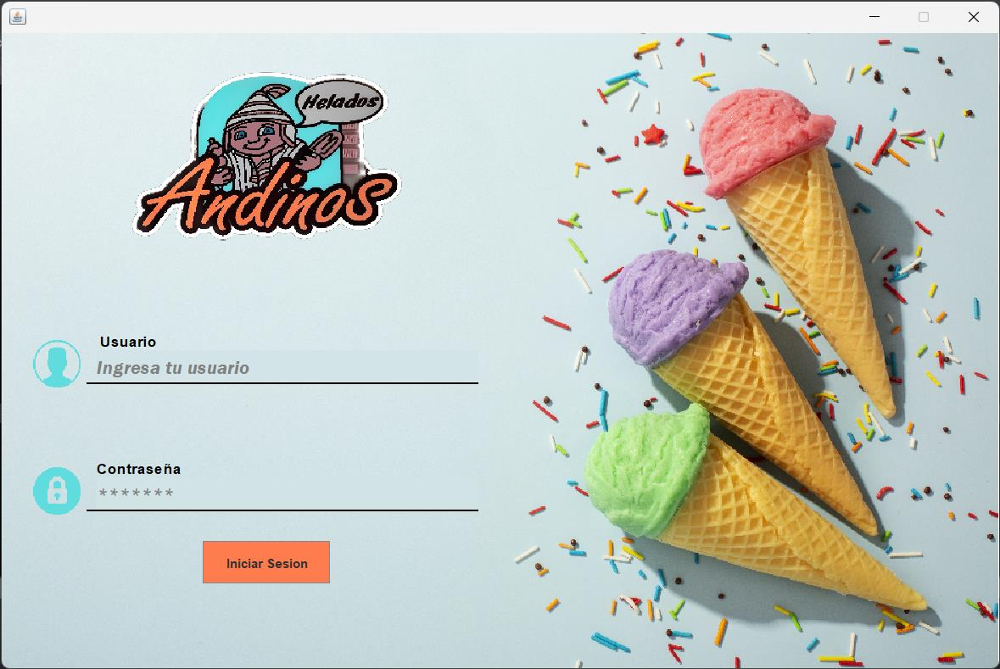
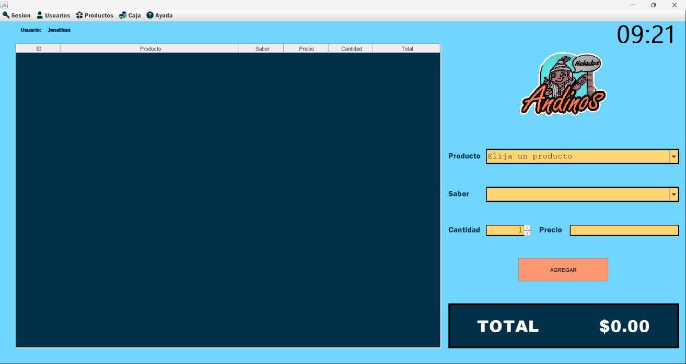
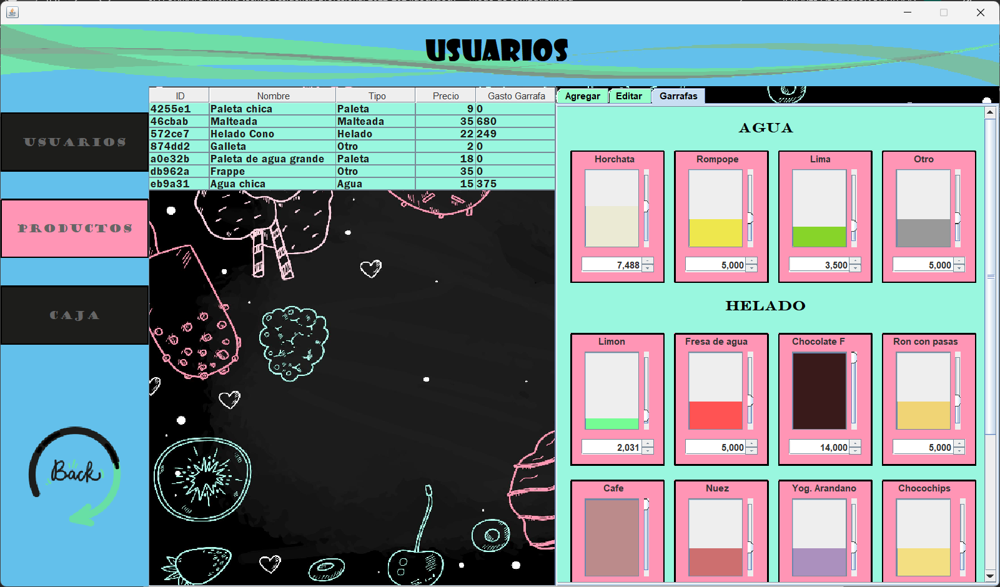
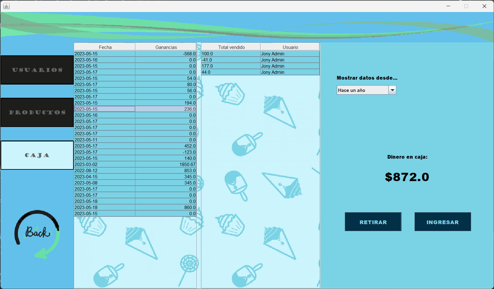
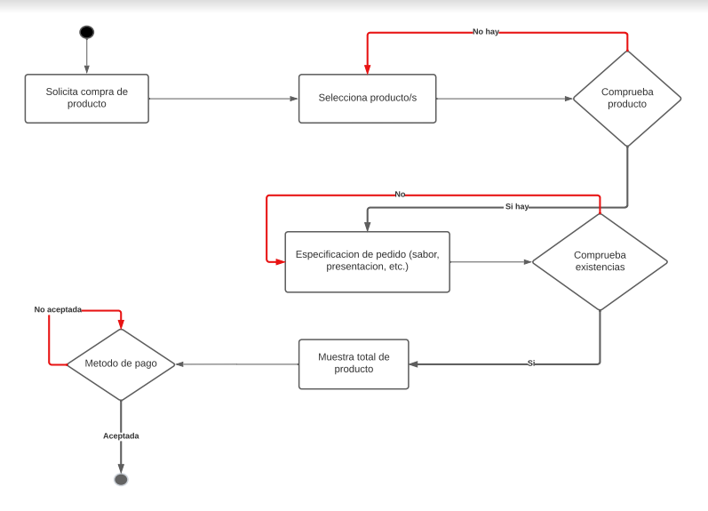

# 🍦 Sistema de Punto de Venta - Helados Andinos

> **Un sistema de gestión integral diseñado para neverías, con control visual de inventario, ventas rápidas y administración de flujo de caja.**

---

## Descripción

**pVentaAndinos** es una aplicación de escritorio robusta desarrollada en **Java**, creada para optimizar la operación diaria de una heladería o nevería. 

A diferencia de los puntos de venta genéricos, este sistema incluye características específicas para el nicho, como la **gestión gráfica de niveles en garrafas** (para nieves y aguas), permitiendo un control de inventario más intuitivo y realista basado en volumen y no solo en unidades.

## Características Principales

### 🛒 Módulo de Ventas Ágil
- **Interfaz Intuitiva:** Diseño limpio para registrar pedidos rápidamente.
- **Personalización:** Selección de producto, sabor, tamaño y precio en pocos clics.
- **Cálculo Automático:** Totales y cambios calculados al instante para evitar errores humanos.

### 📊 Gestión Visual de Inventario (Garrafas)
- **Monitor de Niveles:** ¡Olvídate de contar bolas de helado! Visualiza el nivel restante de tus garrafas de nieve y agua mediante **barras de progreso gráficas**.
- **Control de Mermas:** Ajuste preciso de mililitros y porcentajes restantes.
- **Catálogo Diverso:** Soporte para helados, paletas, aguas, malteadas y productos varios.

### 💰 Finanzas y Control de Caja
- **Apertura y Cierre:** Registro obligatorio del dinero inicial en caja al comenzar el turno.
- **Historial de Transacciones:** Consulta detallada de ventas, ganancias y totales por fecha.
- **Movimientos de Efectivo:** Botones dedicados para registrar "Retiros" e "Ingresos" (gastos, proveedores, etc.).
- **Reportes:** Filtros para ver ganancias del día, de la semana o históricas.

### 🔐 Seguridad y Usuarios
- **Control de Acceso:** Login seguro con usuario y contraseña.
- **Roles de Usuario:**
  - **Administrador:** Acceso total a configuraciones, inventarios y reportes financieros.
  - **Empleado:** Acceso restringido a ventas y operaciones básicas.

---

## 📸 Galería

| Inicio de Sesión | Punto de Venta |
|:---:|:---:|
|  |  |

| Inventario Visual (Garrafas) | Historial y Finanzas |
|:---:|:---:|
|  |  |

---

## 🛠️ Tecnologías Utilizadas

- **Lenguaje:** Java (JDK 8+)
- **Interfaz Gráfica (GUI):** Java Swing (Diseño personalizado)
- **Base de Datos:** MySQL / MariaDB
- **Arquitectura:** MVC (Modelo-Vista-Controlador)
- **Herramientas:** NetBeans IDE / IntelliJ IDEA

## 📄 Diagrama de Flujo del Proceso

El sistema sigue un flujo lógico para asegurar la integridad de cada venta:

¡Las sugerencias y pull requests son bienvenidas!
---
